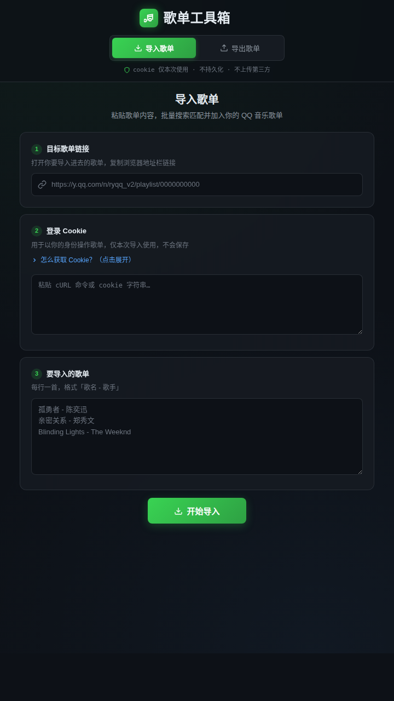

# QQ 音乐歌单工具箱

一个把「QQ 音乐歌单 → AI 分析 → 批量导回」串成闭环的歌单辅助工具。

## 🌐 在线使用

👉 https://qq-music-playlist-tool.onrender.com

无需下载代码，无需配置环境，打开网页即可使用。

**提示：在线服务部署在 Render 免费服务上，长时间无人使用后可能会休眠。首次打开时需要等待一段时间启动，属于正常现象；启动完成后即可正常使用。**

**完整流程：QQ音乐歌单 → 导出TXT → AI分析听歌口味 → AI推荐新歌 → 批量导回QQ音乐**

---

## 能做什么？

### 📤 导出 QQ 音乐歌单

将 QQ 音乐歌单导出成 TXT 文本（`歌曲名 - 歌手`），方便复制给 AI 分析你的听歌口味。这是整个流程的**第一步**：先把自己的歌单导出来。

### 🎵 批量导入歌曲

把 AI 推荐的歌曲整理成 `歌曲名 - 歌手` 格式，一键批量导回 QQ 音乐歌单，不用一首一首添加。这是整个流程的**收尾**：把 AI 挑出的歌加回去。

### 🤖 配合 AI 使用

导出的 TXT 交给 ChatGPT / Gemini 等 AI，让它分析你的音乐审美并推荐新歌；推荐结果整理好后再批量导回——完整闭环见上方「完整流程」。

---

## 🚀 使用方法

### 1. 打开在线工具

打开 https://qq-music-playlist-tool.onrender.com

### 2. 导出歌单

选择「导出歌单」，输入 QQ 音乐歌单链接，即可导出歌曲列表 TXT。导出的 TXT 可以直接复制给 ChatGPT、Gemini 等 AI 进行分析。

### 3. 批量导入歌曲

把 AI 推荐的歌曲列表整理成 `歌曲名 - 歌手` 格式，选择「导入歌单」粘贴进去，工具会自动解析并批量添加。

---

## 📺 视频演示

我录制了一期使用该工具的完整过程，发布在 B 站：

▶️ [QQ 音乐歌单工具箱 · 使用演示](https://www.bilibili.com/video/BV1Lg8i6TEhb/)

---

## 🔐 关于 QQ 音乐 Cookie

批量导入功能需要使用 QQ 音乐 Cookie。Cookie 仅用于完成 QQ 音乐相关操作，不需要把 QQ 音乐账号密码提供给工具。

工具支持直接粘贴浏览器复制的 cURL 命令，自动提取 Cookie。

**不要把自己的 Cookie 分享给其他人。**

---

## 📌 注意事项

- 本工具不是 QQ 音乐官方工具。
- QQ 音乐相关接口或网页结构发生变化时，部分功能可能失效。
- 免费在线服务运行在 Render 免费服务上，长时间无人使用后可能会休眠，首次访问时需要等待一段时间启动。
- 请勿将自己的 QQ 音乐 Cookie、账号信息等敏感内容公开到 GitHub。

---

## ❤️ 项目初衷

这个工具主要是为了解决一个很实际的问题：

**AI 能推荐一堆好歌，但 QQ 音乐只能一首一首添加，而你的歌单又没法直接喂给 AI 分析。**

所以这个工具把「导出歌单 → AI分析 → 批量导回」这条链路变得简单一点。

如果觉得工具有用，欢迎 Star ⭐。
